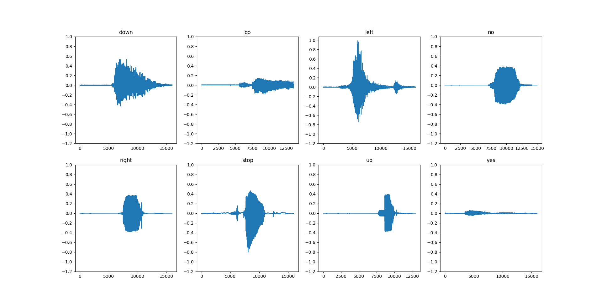
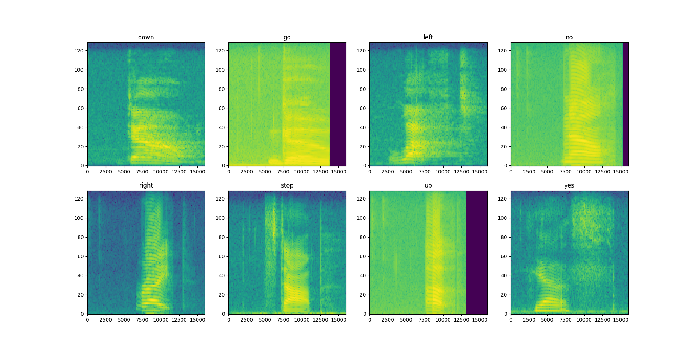
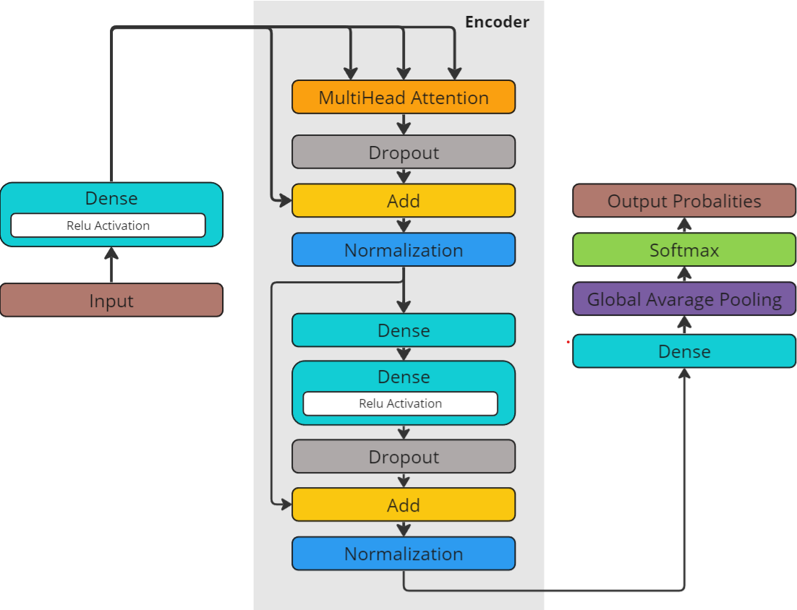
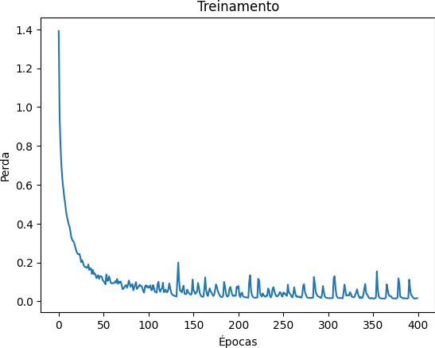
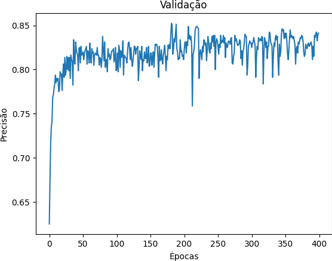
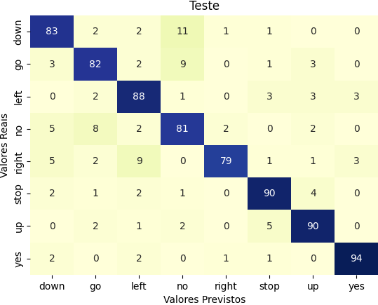
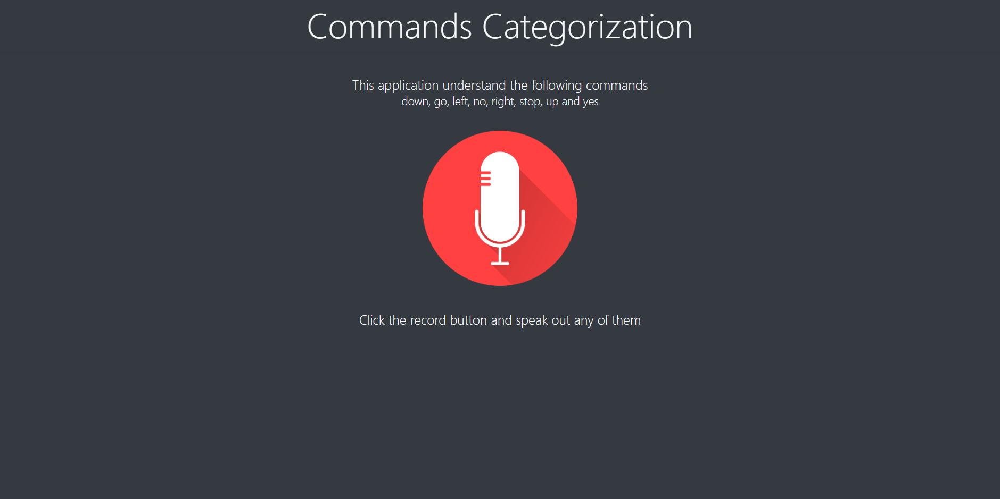

# Commands Categorization

This document is available in [English](README-en.md), but it's also available in [Portuguese](README.md).

## Overview

This project is the foundation of my [Bachelor's Thesis](TCC.pdf) for my undergraduate degree in [Applied and Computational Mathematics](https://www.ime.usp.br/bmac/) at the [Instituto de Matemática e Estatística](https://www.ime.usp.br) of [USP](https://www5.usp.br).
The work focuses on studying the Transformer architecture and its application in speech command categorization, which involves identifying and classifying different types of instructions or requests issued through human speech. The repository contains the implementations used, from data preprocessing, model creation, to training definitions, and generation of graphs for result evaluation.

## Technologies


## Data

Due to the nature of the problem studied, the data follows the pattern of pairs:

- ### Audios
  Audios follow the one-dimensional representation in WAV file format:
  
  However, in the preprocessing phase, they are converted to the two-dimensional format of Short-time Fourier transform (STFT) spectrogram:
  

- ### Labels
  They are the numerical representation for the commands, the defined indices are as follows:

  | **Index** | 1    | 2  | 3    | 4  | 5     | 6    | 7  | 8   |
  |------------|------|----|------|----|-------|------|----|-----|
  | **Text**  | Down | Go | Left | No | Right | Stop | Up | Yes |

  From the defined indices, commands are identified by a vector whose values sum to one. When representing a command, its index will be the highest value in the vector. For example, a representation of the command *"No"* can be done by:

  | **Index** | 1 | 2 | 3 | 4 | 5 | 6 | 7 | 8 |
  |------------|---|---|---|---|---|---|---|---|
  | **Vector**  | 0 | 0 | 0 | 1 | 0 | 0 | 0 | 0 |

The pairs are divided with the same proportions for each command into three sets:

- ### Sets
  | **Name**    | Training | Validation  | Test     |
  |-------------|-------------|------------|-----------|
  | **Size** | 6400 (80%)  | 800 (10%)  | 800 (10%) |

## Model

- ### Architecture
  The architecture of the model used was based on the Transformer architecture, especially on the concept of the Encoder and the use of the Self-Attention mechanism. The representation in flowchart form can be visualized by the drawing:
  

  Each layer present in the architecture has a specific role for the model. These are properly documented in the work. To delve into the details, refer to section **(3.1) Camadas**.

## Training

- ### Definitions

    - **Loss Function**: Categorical Crossentropy
    - **Accuracy Function**: Categorical Accuracy
    - **Optimizer**: Adaptative Moment Estimation
    - **Hyperparameters**:
        - Epochs: 400
        - Batch size: 32
        - Heads: 2
        - Dropout rate: 0.1

  Each chosen definition has a specific function. These are properly documented in the work. To delve into the details, refer to section **(3.2) Treinamento**.

- ### Choice
  The criterion for choosing the weights that define the model is made from the epoch where the highest accuracy for the validation set is found.

## Results

- ### Accuracy
  | Set     | Training | Validation | Test  |
  |--------------|-------------|-----------|--------|
  | **Accuracy** | 99.08%      | 85.25%    | 85.87% | 

- ### Behavior
  - **Loss Function** (Training) 
  
      

  - **Accuracy Function** (Validation)
  
      
  
  - **Confusion Matrix** (Test)
  
      

## Example Screenshot



## How to Use?
1. Ensure Docker is installed on your machine.
2. Clone this repository to your local environment.
3. Navigate to the project directory.
4. In the terminal, run the following command to build and start the Docker container:
    - On Linux, run:
        ```bash
        docker compose up
        ```

    - On Windows, run:
        ```bash
        docker-compose up
        ```

5. After building the container and starting the application, access [http://localhost:5000](http://localhost:5000) in your web browser to explore.

**Note:** 
- Ensure that port `5000` is not being used by another application on your system to avoid conflicts. If necessary, you can modify the port mapping in the [docker-compose.yaml](docker-compose.yaml) file.

## References
- Shafran, I., Riley, M., & Mohri, M. (2003). Voice signatures. In: 2003 IEEE workshop on automatic speech recognition and understanding (IEEE Cat. No. 03EX721), pp. 31–36.


- Sivanandam, S., & Paulraj, M. (2009). Introduction to artificial neural networks. Vikas Publishing House.


- Vaswani, A., et al. (2017). Attention is all you need. Advances in neural information processing systems 30.

